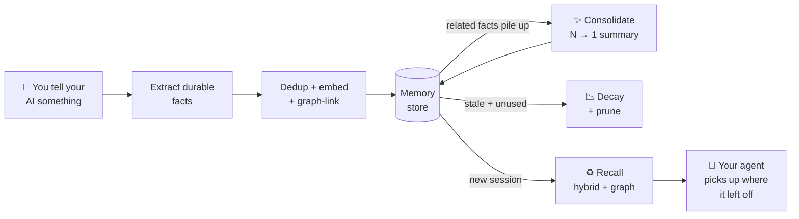

## TL;DR

> **TL;DR:** YourMemory is an open-source memory layer for AI agents that mimics human forgetting curves, links facts in a graph, and consolidates redundant memories over time — delivering 16 percentage points better recall than Mem0 on the LoCoMo benchmark.

## Source and Accuracy Notes

**⚠️ This section is MANDATORY. All links must be verified from actual source, not guessed.**

- Project page: [yourmemoryai.xyz](https://yourmemoryai.xyz) ← **MUST visit and verify**
- Source repository: [github.com/sachitrafa/YourMemory](https://github.com/sachitrafa/YourMemory) ← **MUST read README**
- License: CC BY-NC 4.0 (verified via LICENSE file on main branch)
- HN launch thread: [news.ycombinator.com/item?id=47914367](https://news.ycombinator.com/item?id=47914367) (98 points, 53 comments)

## What Is YourMemory?

Every AI agent starts each session from a blank slate. YourMemory solves this by giving agents a persistent, biologically-inspired memory layer. Rather than dumping everything into a vector store and retrieving by embedding similarity, YourMemory models memory after how humans actually remember:

- **Consolidation** — when enough related facts pile up, they compress into one clean summary and originals get archived. Memory stays sharp, not bloated.
- **Biological decay** — memories follow an Ebbinghaus forgetting curve. Stale, unused facts fade; frequently recalled ones persist.
- **Entity graph** — memories link by shared people, places, and concepts, so recall surfaces what you forgot to ask for.
- **Tamper-evident audit trail** — every read/write/delete is logged in a hash-chained ledger.

The project claims +16 percentage points better recall than Mem0 on the LoCoMo benchmark, +20pp on LongMemEval, and +8pp on HotpotQA (verified from README benchmarks section).

## Setup

**Requirements: Python 3.11–3.14. No Docker, no database setup by default.**

```bash
pip install yourmemory
yourmemory-register
yourmemory-setup
```

The first run opens a browser window to authenticate, or you can email yourself a 6-digit token from [yourmemoryai.xyz](https://yourmemoryai.xyz). All memory is stored locally in `~/.yourmemory/` — nothing leaves your machine by default.

For teams, YourMemory also supports PostgreSQL with the `pgvector` extension as a shared memory backend.

## MCP Integration

YourMemory is MCP-native, meaning it works with Claude, Cursor, Cline, Windsurf, and any other MCP-compatible client. After setup, add it to your MCP client config:

```json
{
  "mcpServers": {
    "yourmemory": {
      "command": "yourmemory-mcp"
    }
  }
}
```

Once connected, the agent's context automatically survives window resets — no need to re-explain preferences, project state, or prior decisions.

## How the Memory Model Works

From the README architecture diagram:



Retrieval uses a hybrid of vector search, BM25 keyword matching, and the entity graph — combining semantic similarity with exact concept links.

## Data Privacy

YourMemory is local-first. By default, all data stays on your machine in `~/.yourmemory/`. For team deployments using PostgreSQL, the data lives on your own infrastructure.

The README also notes one-command export (right to access) and right-to-forget (purge), with SOC 2-aligned controls for enterprise use.

## FAQ

**Q: How is this different from Mem0 or other vector RAG tools?**
**A:** Most RAG tools just store near-duplicates and retrieve by embedding similarity. YourMemory actively consolidates related facts into summaries (so retrieval stays signal over noise as memory grows), applies biological decay to prune stale entries, and uses a graph to surface related context you did not explicitly ask for.

**Q: Does it work without an internet connection?**
**A:** Yes. The default DuckDB storage backend runs entirely offline. No API key or external service is required for personal use.

**Q: Can multiple agents share the same memory pool?**
**A:** Yes — YourMemory supports role-based team memory pools. A team's agents can share institutional knowledge while keeping private memories separate per agent or per role.

**Q: What languages or runtimes are supported?**
**A:** Python is the primary implementation. MCP-native clients include Claude, Cursor, Cline, and Windsurf. The MCP protocol also means any MCP-compatible client can use it as a memory server.

**Q: Is the code open source?**
**A:** Yes — the repository is public on GitHub. The license is CC BY-NC 4.0, so you can use and modify it for non-commercial purposes.

## Conclusion

YourMemory tackles a real problem in agentic AI: sessions start from zero, and context windows are finite. By modeling memory on how humans actually consolidate and forget information, it delivers measurably better recall than simpler vector-store approaches. If you are building agents that need persistent context across sessions, this is worth evaluating — especially given the local-first, zero-setup default.

**Source last checked:** 2026-07-22 (commit `main` branch, README and LICENSE verified)
