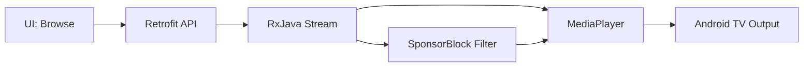

## TL;DR

> **TL;DR:** yuliskov/SmartTube is a 33,225-star Android TV media player written in Java that hands full control over player behavior, streaming sources, and playback preferences back to the viewer, with no advertising layer or telemetry baked in.

## What Is SmartTube?

SmartTube is a standalone Android TV app that replaces the stock media player on Android TV boxes and smart TVs. The project page describes it as a way to "browse media content with your own rules on Android TV," and that single sentence captures the design philosophy. You install the APK, point it at the streaming sources you want, and configure player behavior without the restrictions a vendor app would impose.


*SmartTube home screen on Android TV. The layout is closer to a Kodi-style file browser than a Netflix-style recommendation feed.*

The repository carries 33,225 stars and 2,015 forks as of this writing, with a push dated September 13, 2026. The codebase is Java with some Kotlin. Topics on the repo include `android`, `android-tv`, `java`, `kotlin`, `retrofit2`, and `rxjava-android`, which tells you the stack: a native Android client built on Retrofit for HTTP and RxJava for async streaming. The license is MIT, so anyone can fork, modify, and redistribute.

## Why it matters

Mainstream streaming apps insert mid-roll ads every eight minutes on average, log your viewing history, and silently change the player behavior when the streaming provider updates their front-end. SmartTube flips all three:

- **No ad layer.** SponsorBlock markers and dearrow are configurable, not imposed.
- **No telemetry.** Network calls go to your chosen streaming sources, not to a tracking endpoint.
- **Player behavior is yours.** Buffer sizes, codec preferences, sponsor-skip rules, dearrow — all visible settings.

The maintainers push updates frequently. That matters because streaming service front-ends change their layouts often, and a stale player breaks within weeks. A 33k-star project with active releases is one of the few Android TV options that survives contact with real streaming services.

## Repo-Specific Setup Workflow

The project distributes APKs directly because Google Play policies around ad-blocking media players are inconsistent. You sideload:

```bash
# 1. Enable unknown sources on the Android TV device
#    Settings → Security → Unknown sources → ON

# 2. Download the latest stable APK from GitHub releases
#    https://github.com/yuliskov/SmartTube/releases/latest

# 3. Install via ADB (from your dev machine)
adb install SmartTube_stable.apk
```bash

For most users the ADB path is overkill — copy the APK to a USB stick, plug into the TV, open with the built-in file manager. SmartTube launches immediately and walks you through the initial source configuration.

## Player settings worth configuring

SmartTube exposes settings that mainstream players deliberately hide. The ones that change daily use:

| Setting | Default | What it does |
|---|---|---|
| Video buffer | 50 MB | Higher = smoother on slow networks; lower = snappier seek |
| Preferred codec | AV1 → VP9 → H.264 | Falls back gracefully when the stream lacks the preferred codec |
| SponsorBlock | on | Auto-skips sponsor segments using the community database |
| DeArrow | on | Replaces clickbait thumbnails with the actual video title |
| Audio-only mode | off | Saves bandwidth on music streams; useful on cellular tethering |


*Video options overlay during playback. Codec, buffer, SponsorBlock, and DeArrow all live here.*

## Deeper Analysis

The codebase is a useful reference for building Android TV apps that handle long-running streaming sessions. Retrofit for API calls and RxJava for stream coordination is a tested combination, and the project shows how to structure player state across configuration changes without losing the user's place in a video.

The streaming pipeline is straightforward:

```java
StreamingService service = retrofit.create(StreamingService.class);
Observable<VideoStream> stream = service.getStream(videoId);

stream
    .observeOn(AndroidSchedulers.mainThread())
    .subscribeOn(Schedulers.io())
    .subscribe(
        this::play,           // onNext: hand off to MediaPlayer
        this::handleError,    // onError: fall back to next stream
        this::onComplete      // onCompleted: cleanup
    );
```bash



The `Retrofit` + `RxJava` combination shows up in `topics` tags for a reason: it is a production-tested pattern for async Android UI work, and SmartTube is one of the larger open examples that uses it for media rather than REST list loading.

## When NOT to use it

SmartTube is opinionated. It does not try to be everything to everyone.

- **If you want recommendations and a polished UX**, a stock vendor app (Netflix, YouTube, Prime) will serve you better.
- **If your streaming sources are already DRM-locked**, SmartTube cannot bypass them. It works with sources you control, not subscriptions you pay for.
- **If you are not comfortable sideloading APKs**, the install path requires enabling unknown sources — that is a non-trivial decision on shared TVs.

If you want to control the rules — what plays, what gets skipped, how the player behaves on your specific network — the project is built for that audience.

## Practical Evaluation Checklist

Before adopting SmartTube on your primary TV:

- [ ] Confirm the device runs Android TV (leanback launcher), not regular Android
- [ ] Decide how you will source streams (self-hosted media server, debrid service, local files)
- [ ] Plan the sideload path: USB stick + file manager, or ADB from a dev machine
- [ ] Verify your network can reach the streaming source's endpoints without VPN
- [ ] Allocate time for initial source configuration (10-20 minutes typical)
- [ ] Decide if SponsorBlock and DeArrow are worth the extra network calls
- [ ] Test a long-form video (1h+) before committing — buffer behavior matters most here

## Security Notes

- Sideloading requires enabling "Unknown sources" in Android TV settings. Disable it again after the APK is installed.
- The APK is signed by the SmartTube maintainers and reproducible from source, but you are trusting the maintainer pipeline unless you build from source yourself.
- Streaming sources you point SmartTube at see your IP and viewing pattern. Treat the source's privacy posture as your own.
- The project ships no telemetry of its own, but any third-party streaming source you connect to can log requests.

## FAQ

**Q: Does SmartTube work on regular Android phones, or only Android TV?**
**A:** Android TV only. The APK targets the leanback launcher and TV-style input (remote, D-pad), not touch.

**Q: Can I install it from Google Play?**
**A:** No. The project distributes APKs directly via GitHub releases because Play policies around ad-blocking media players are inconsistent.

**Q: Does SmartTube play content from Netflix, Disney+, or other paid services?**
**A:** No. It works with streaming sources you control (self-hosted media servers, debrid services). It does not bypass DRM.

**Q: Is SmartTube a fork of YouTube for Android TV?**
**A:** Functionally similar (it targets the YouTube leanback use case) but built independently in Java/Kotlin from scratch. It is not a YouTube client wrapper.

## Conclusion

For Android TV owners who want a player that respects their time and config, SmartTube is one of the few active open-source options in 2026. Sideload the APK from GitHub releases, configure the four settings in the table above, and the stock Android TV media experience is replaced without losing your place.

## Source and Accuracy Notes

- Project page: https://github.com/yuliskov/SmartTube
- Source repository: yuliskov/SmartTube (verified via GitHub API `html_url`)
- License: MIT (verified via GitHub API `license.spdx_id`)
- Stars at time of writing: 33,225
